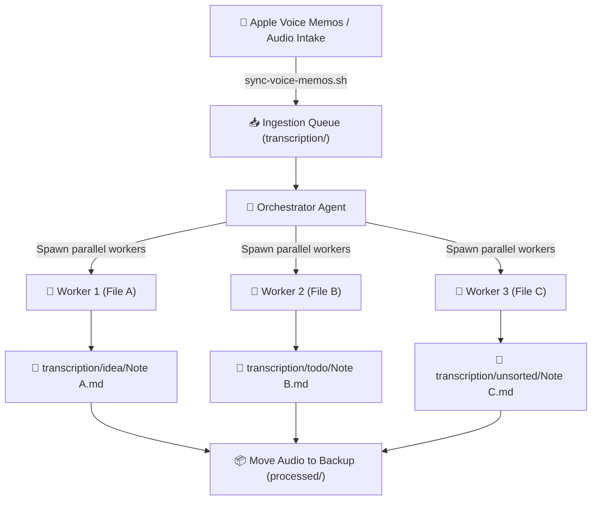

# 🎙️ voice-to-vault

> Zero-friction voice memo ingestion and AI transcription for Obsidian and plain-text markdown vaults. Powered by multi-agent parallel orchestration.

---

## ⚡ Why voice-to-vault?

Capturing fleeting thoughts on the go should be instant. But getting those recordings into a knowledge base has historically been a chore:

* **Native Apple Transcription is Patchy**: Apple's on-device transcription often truncates sentences, struggles with technical jargon, and misinterprets conversational cadence.
* **Copy-Pasting is Laborious**: Manually exporting transcripts out of Voice Memos involves repetitive clicking, broken carriage returns, strange formatting artifacts, and tedious manual cleanup.
* **Vault Bloat**: Storing raw audio recordings inside your Obsidian vault rapidly exhausts **Obsidian Sync** storage limits and turns mobile sync into a crawl.
* **Data Loss Anxiety**: Automated tools that delete voice memos immediately upon ingestion introduce risk if a transcription fails or an edge case occurs.

**voice-to-vault** automates the entire journey from your microphone to your vault, applying intelligent multi-agent processing while keeping your audio safe.

---

## ✨ Features

### 🧠 Intelligent Transcription & Correction
* **Substantive Verbatim Accuracy**: Captures thoughts fully without stripping essential nuance or over-summarizing.
* **Conversational Disfluency Removal**: Automatically removes stutters and filler words (*"um"*, *"ah"*, *"like"*).
* **Mid-Speech Self-Correction**: When you change your mind mid-sentence (*"Let's schedule that for Tuesday—actually, wait, Wednesday at 2pm"*), the AI understands the correction and faithfully records your intended outcome.
* **Noisy Environment Resilience**: When recording on windy streets or in noisy cafés, contextual understanding reconstructs muffled speech while honestly marking truly unintelligible audio as `[inaudible]` rather than hallucinating.

### 🎧 In-Note Audio Playback (Without Vault Bloat)
* **Audio Outside Vault**: Processed audio files are safely moved to an external backup directory (`transcription/processed/`).
* **Zero Obsidian Sync Quota Used**: Your vault stays lightweight and fast.
* **Native Inline Player**: Each generated note embeds an HTML5 audio player pointing to the local absolute path:
  ```html
  <audio controls src="file:///Users/username/Documents/Audio/transcription/processed/20260918 113006.m4a"></audio>
  ```
  Click play directly inside Obsidian to hear the original recording whenever you want.

  > **Heads up:** that path is absolute, so it contains your macOS username. Harmless inside a private vault, but it travels with the note if you ever publish, share, or export it (Obsidian Publish, a public repo, a screenshot). Strip the `<audio>` line before publishing, or point `AUDIO_PROCESSED_DIR` somewhere outside your home directory.

### 🛡️ Safety by Design
* **Manual Voice Memos Cleanup**: The sync process only *copies* recordings from Apple Voice Memos. Deletion from the Voice Memos app remains intentionally manual so you never lose an original recording to an unexpected automation glitch.
* **Archival, Never Deletion**: The intake process moves audio to a backup folder once the markdown note is confirmed on disk. Audio is never automatically deleted.
* **One Deliberate Exception**: A `.qta` is removed *after* it has been converted to `.m4a` and that `.m4a` has been verified non-empty, so a single recording is never queued twice. If the conversion fails, the `.qta` is kept and moved to `errors/`. Note that `afconvert` re-encodes, so a multichannel source is not preserved — set `SYNC_EXTENSIONS="m4a"` if you would rather handle those yourself.
* **No Note Is Ever Dated in the Future**: See below.

### 📅 Future-Date Guard

Apple stamps the recording date into the filename, and the pipeline trusts filenames over filesystem timestamps — copying a file rewrites its `mtime`, so `mtime` is worthless here. But a filename can be wrong, and one failure mode is common enough to be worth naming:

> A date formatter using `YYYY` (ISO **week**-year) where it meant `yyyy` (calendar year) rolls recordings from the last days of December into the following year. With Sunday-start weeks, 28 December 2025 was the first day of the week containing 1 January 2026 — so recordings from the 28th to the 31st were stamped `2026`, while the 27th was stamped correctly. A batch lands exactly one year in the future, always at the end of December.

This was found in a real archive: eight recordings filed three months ahead, sitting in exactly the gap their correct dates would have filled.

**The guard is absolute — a note is never written with a date later than today.** When a parsed date is in the future:

| Situation | Action | Marker |
| --- | --- | --- |
| Date is 25–31 December and one year back is valid | Subtract one year | `date_source: corrected-week-year` |
| Any other future date | Use the file creation date | `date_source: file-creation` |
| No usable date anywhere | Use today | `date_source: run-date` |

Every correction is named in the run report, with the rejected date, the substituted date, and the reason. The `date_source` property is written **only** when a date needed intervention, so filtering on it in Obsidian Bases — or a plain `grep -rl date_source` — returns precisely the notes worth reviewing. Correctly dated notes carry no extra metadata at all.

The sync script flags future-dated filenames at copy time too, so a bad batch is visible before transcription rather than after:

```
[2026-09-18 23:03:16] Warning: future-dated filename, will be corrected at intake: 20261228 101918-DEEF215B.m4a
[2026-09-18 23:03:16] Warning: 2 copied recording(s) carry a future date in their filename.
```

The recording is always transcribed regardless. A bad filename is never a reason to lose what you said.

### 📂 Automatic Spoken Topic Routing
Prefix your memo with a spoken keyword (*"Idea"*, *"Dream"*, *"Todo"*, *"Meeting"*), pause for a second, and speak. **voice-to-vault** will automatically file the note into `transcription/{keyword}/`. Memos without a keyword route safely into `transcription/unsorted/`.

### 🌙 Optional: Dream Notes to Daily Notes
When enabled, recordings prefixed with `"Dream"` automatically append their transcript directly to your previous day's daily note under `# dream` (reflecting the night you actually had the dream).

### 🌐 Tool-Agnostic & Zero Lock-in
* **Not Just for Voice Memos**: Any audio from any source can be dropped straight into the intake folder — see [Bring Your Own Audio](#-bring-your-own-audio) below.
* **Not Just for Obsidian**: The output is 100% standard, portable Markdown. It works out of the box with Logseq, Foam, VS Code, or plain directory trees.
* **Not Just for macOS**: Only the optional Voice Memos sync step is Apple-specific. The transcription pipeline itself runs anywhere.

---

## 📥 Bring Your Own Audio

**The Voice Memos sync is a convenience, not a requirement.** It exists only to spare you from digging around inside a macOS sandbox container. The transcription pipeline itself neither knows nor cares where a recording came from.

**To transcribe audio from anywhere, just drop the files into your intake folder and run the skill:**

```bash
# AUDIO_INGESTION_DIR from your config.env
cp ~/Downloads/*.mp3 ~/Documents/Audio/transcription/
```

That is the entire process. No sync script, no Automator wrapper, no Full Disk Access, no Apple hardware.

**Accepted formats:** `.m4a`, `.mp3`, `.wav`, `.aac`, `.qta`. QuickTime audio (`.qta`) is converted to `.m4a` automatically during intake.

**Sources that work well:**

| Source | Notes |
| --- | --- |
| Android / other phone recorders | Usually `.m4a` or `.mp3`, drop in as-is |
| Field recorders (Zoom, Tascam, DJI mics) | `.wav` straight off the SD card |
| WhatsApp, Telegram, Signal voice notes | Export and drop in |
| Meeting and call recordings | Zoom, Meet, Teams exports |
| Interviews and lectures | Any length; long files simply take longer |
| Dictaphones | Anything that produces a standard audio file |

**Two things to know:**

1. **Only the root of the intake folder is scanned.** `processed/` and `errors/` are deliberately skipped, so nothing is ever transcribed twice. Don't nest your files in subfolders.
2. **Dates come from the filename, never from the filesystem.** Copying a file rewrites its modification time, so `mtime` is worthless here. Files named `YYYYMMDD HHMMSS-*` (the Voice Memos convention) parse exactly; any standard ISO date in the name is also recognised. Anything else falls back to the file creation date and is flagged in the run report so you can correct it.

Spoken keyword routing works identically regardless of source — say *"Idea."*, pause, then talk, and the note files itself. See [Automatic Spoken Topic Routing](#-automatic-spoken-topic-routing).

---

## ☁️ Where Transcription Happens

**This is the cloud version.** Transcription is performed off-device by a multimodal agent runtime — Google Antigravity or Claude Code — that listens to the audio natively. There is no separate transcription API key, no Whisper installation, and no multi-gigabyte model download.

**Why off-device is the default.** Frontier multimodal models are markedly better at precisely the things that break voice memos in practice: technical jargon, proper nouns, mid-sentence self-correction, wind and café noise, and switching between languages. On-device models tend to fail *silently* — returning a fluent, clean-looking transcript that is quietly wrong, which is worse than one that visibly struggles. This project optimises for transcript fidelity, and off-device is the maintained path.

**The trade-off, stated plainly.** Your recordings are uploaded to your agent provider for processing and are subject to that provider's data handling and retention terms. Nothing else in this repo transmits audio anywhere — there is no third-party service, no telemetry, no analytics — but the audio does leave your machine. If a particular recording shouldn't, don't put it in the intake folder.

**A local version is entirely possible.** Everything here except one step is transcription-engine agnostic — batching, date parsing, keyword routing, note formatting, archival, and reporting all work unchanged. Going fully on-device means replacing step 4.1 of the skill ("Listen to Audio") with a shell call:

```bash
# Example: whisper.cpp — no audio leaves the machine
whisper-cli -m models/ggml-large-v3.bin -f "$file" -otxt
```

Pull requests wiring up whisper.cpp, faster-whisper, MacWhisper, or Parakeet as a drop-in alternative are welcome. Be aware you are trading accuracy for locality.

---

## 📋 Clean, Streamlined Frontmatter

Every transcription note begins with a clean YAML schema designed to work seamlessly with Obsidian Bases, Dataview, and search tools without unnecessary metadata clutter:

```yaml
---
type: transcription
title: "2026-09-18 - 02-15 - idea - distributed audio pipeline"
description: "Architectural outline for streaming audio ingestion into multi-agent subtasks."
tags: []
timestamp: 2026-09-18T21:00:00Z
date: 2026-09-18
duration: 02.15
---
```

### Note Body Structure:
```markdown
## [[2026-09-18]]
<audio controls src="file:///Users/username/Documents/Audio/transcription/processed/20260918 113006.m4a"></audio>

# overview
Architectural outline for streaming audio ingestion into multi-agent subtasks.

# transcript
Here is the complete, cleaned transcript of your spoken audio...
```

---

## 🏗️ How It Works: Multi-Agent Parallel Orchestration

Instead of a single AI model attempting to process a batch of 20 audio files sequentially (leading to context exhaustion and long wait times), **voice-to-vault** employs a concurrent team:



1. **Orchestrator**: Scans the intake directory, parses dates from filenames, measures durations, and batches up to 20 recordings.
2. **Parallel Workers**: Workers run concurrently. Each worker listens to its assigned audio file natively, formats the note, routes by keyword, and confirms file creation on disk.
3. **Archivist**: Moves verified audio files to external storage and produces a summary report.

---

## 🚀 Quick Start

### 1. Clone & Configure
```bash
git clone https://github.com/rupertbreheny/voice-to-vault.git
cd voice-to-vault

# Copy and edit the configuration template
cp config.example.env config.env
nano config.env
```

Set your paths in `config.env`:
```bash
VAULT_DIR="$HOME/Documents/Obsidian/Main"
AUDIO_INGESTION_DIR="$HOME/Documents/Audio/transcription"
AUDIO_PROCESSED_DIR="$AUDIO_INGESTION_DIR/processed"
SYNC_EXTENSIONS="m4a,qta"
TRIGGER_WORDS="idea,dream,todo,meeting,journal,note"
SYNC_DREAM_TO_DAILY=false
```

### 2. Install the Skill — Antigravity and Claude Code

The skill lives once, in [`skills/voice-to-vault/`](skills/voice-to-vault/). Both runtime directories are committed as symlinks pointing at it, so a fresh clone is already wired for both and there is no duplicated copy to keep in sync:

```
skills/voice-to-vault/           ← canonical source (edit here)
.agents/skills/voice-to-vault  → symlink  (Google Antigravity)
.claude/skills/voice-to-vault  → symlink  (Claude Code)
```

> **On Windows:** git only creates real symlinks when `core.symlinks` is enabled, so both runtime paths may clone as plain text files containing a path. Run `git config --global core.symlinks true` before cloning, or just point your runtime at `skills/voice-to-vault/` directly. macOS and Linux are unaffected.

**Project scope (recommended).** Open the cloned repo as your working directory. Both runtimes discover the skill automatically — there is nothing to install.

**User scope (available in every project).** Link it into your home directory instead:

```bash
# Google Antigravity
mkdir -p ~/.agents/skills
ln -s "$PWD/skills/voice-to-vault" ~/.agents/skills/voice-to-vault

# Claude Code
mkdir -p ~/.claude/skills
ln -s "$PWD/skills/voice-to-vault" ~/.claude/skills/voice-to-vault
```

Swap `ln -s` for `cp -R` if you would rather hold a detached copy you can edit without touching the repo. Verify either runtime picked it up by listing your available skills; `voice-to-vault` should appear.

---

### 3. Apple Voice Memos Permission Setup (macOS, optional)

> Skip this entire step if you are dropping audio into the intake folder yourself. It is only needed to pull recordings out of the Apple Voice Memos container.

Apple stores recordings inside protected containers. To allow synchronization without sandbox errors:
* Follow the 2-minute [macOS Permissions Guide](scripts/setup-permissions.md) to wrap `scripts/sync-voice-memos.sh` in an Automator helper with Full Disk Access.

**What the sync copies.** Voice Memos does not only write `.m4a`. Depending on the recording format your device is set to, it also writes QuickTime audio (`.qta`) — commonly seen with stereo and spatial capture. Both are copied by default; adjust `SYNC_EXTENSIONS` in `config.env` to change that. Container metadata (`CloudRecordings.db`, waveform caches) is ignored automatically.

**What the sync never does.** It only ever copies. Nothing is deleted from Voice Memos, by this script or any other part of the pipeline. Clearing the app is left to you, deliberately.

Each run reports what it did — copied, already present, and anything skipped:

```
[2026-09-18 22:39:28] Copied: 20251101 143225-C9A898BC.qta
[2026-09-18 22:39:28] Sync finished — copied 5, already present 1, not downloaded 1, non-audio entries ignored 3
[2026-09-18 22:39:28] Warning: 1 recording(s) are in iCloud but not on this Mac.
```

Recordings that iCloud has offloaded are not on disk, so they cannot be copied. They are reported rather than silently skipped — open them once in Voice Memos to download, then re-run.

### 4. Run Ingestion & Transcription

| Runtime | Invocation |
| --- | --- |
| Google Antigravity | `/voice-to-vault` |
| Claude Code | `/voice-to-vault`, or simply ask: *"transcribe my voice memos"* |

Or run the intake script manually:
```bash
./scripts/sync-voice-memos.sh
```

---

## 🗂️ Repository Layout

```
skills/voice-to-vault/         Canonical skill: SKILL.md + references/
  references/fileHandling.md   Intake, date parsing, batching, safe archival
  references/topicRouting.md   Spoken keyword registry and destination routing
  references/noteFormat.md     Frontmatter schema and transcription principles
.agents/skills/                Symlink into skills/ for Google Antigravity
.claude/skills/                Symlink into skills/ for Claude Code
scripts/sync-voice-memos.sh    Copies new recordings out of the Voice Memos container
scripts/setup-permissions.md   macOS TCC / Automator wrapper guide
templates/transcription.md     The note skeleton workers fill in
config.example.env             Copy to config.env (gitignored) and edit
```

`config.env`, all audio formats, and logs are gitignored — your paths and recordings never enter version control.

---

## 🤝 Contributing & Feedback

Contributions, feature suggestions, and workflow improvements are warmly welcomed!
* Have an idea for a new spoken trigger action?
* Want to wire up Whisper / faster-whisper / Parakeet as an on-device alternative to the default off-device path?
* Found an edge case with audio formats?

Feel free to open an **Issue** or submit a **Pull Request**.

---

## 📄 License

Distributed under the [MIT License](LICENSE).
